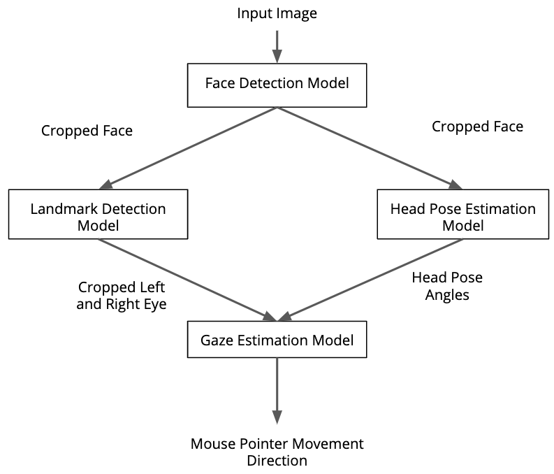
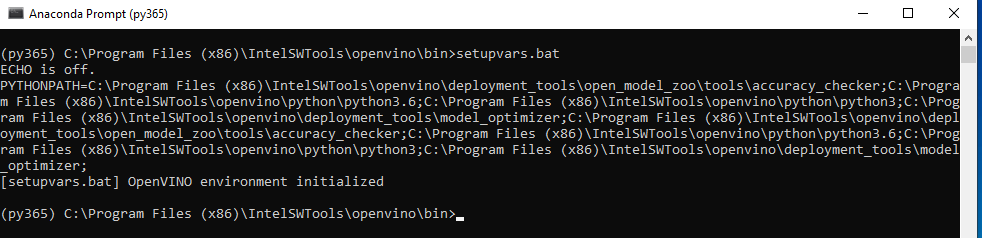
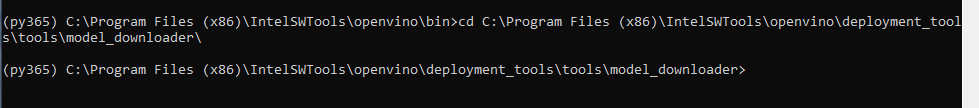
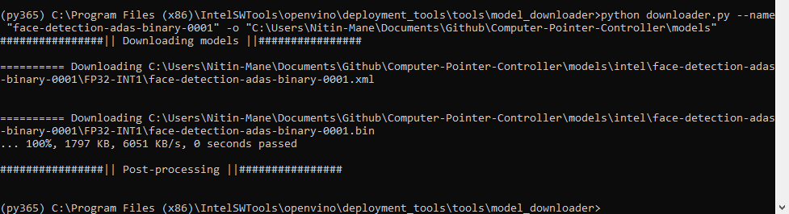
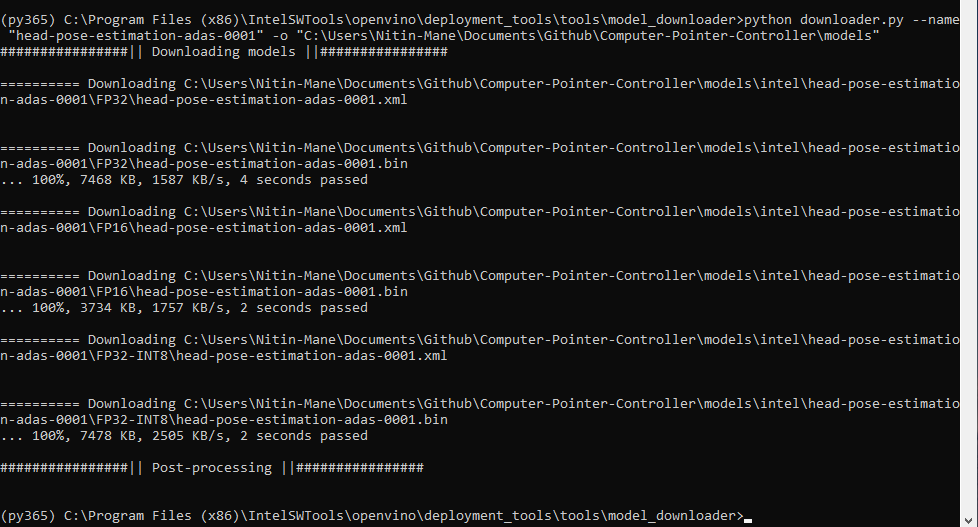
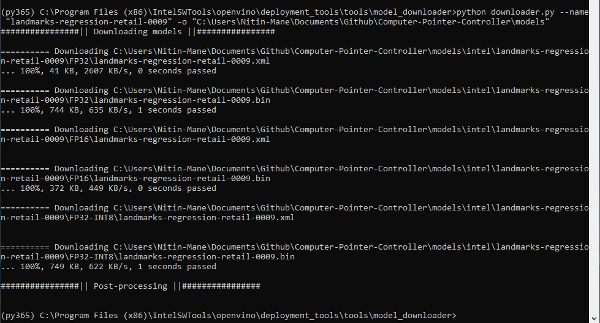
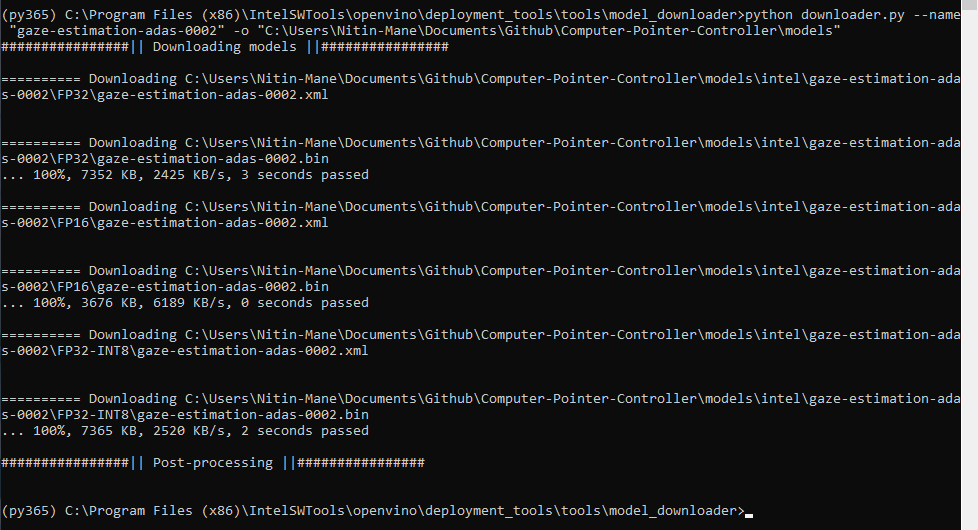

# Computer Pointer Controller

In this project, the task is based on a gaze detection model to control the mouse pointer of the computer. The module state on the Intel model usage and will be applying the Gaze Estimation model to estimate the gaze of the user's eyes and change the mouse pointer position accordingly. This project will demonstrate the ability to run multiple models in the same machine and coordinate the flow of data between those models.

### How it works
 The Inference Engine API from Intel's OpenVino ToolKit are initilize to build the project. The gaze estimation model requires three inputs as follows:

 - The head pose
 - The left eye image
 - The right eye image.

To get these inputs, it is essential to have to this three other OpenVino models:

1. Face Detection
2. Head Pose Estimation
3. Facial Landmarks Detection.

####  The Pipeline
The coordination of the the flow data from the input, and then amongst the different models and finally to the mouse controller. The flow of data will is mentioned:



The flow chart represent the process of the controlling the mouse pointer based on the human gestures of face tracking and eyes movements. The eyes are important factor for this project. The first process is passed with the model inference with detecting the face region and it help to focus on the main features which is higlighted with the position of the person looking at the region this will crop the image and resize the important features mapped on the region. After processing the face region next process is on the head pose estimation module which will track the person face moving direction in 3 axis. the x and y axis is the movement to the left and right where the z-axis represent the up and down movements. The head pose estimation are shown with the angles direction. Similarly the landmark detection module detect the eyes, nose, lips and chin of the human face. In this process the left and right eyes are cropped and sized with the mapped region. the gaze estimation model requires all three input model based on the model prediction the gaze provide the direction movement of the eyes look at each direction and the face movement. The mouse cursor is set with the eyes direction as the gaze and the landmark estimation region mapped with the eyes looking at the features it represent the focus direction where the head pose provide the angle of the movement which the cursor move based on the person look at any corner or edge direction from the box region. 

## Project Set Up and Installation
*TODO:* Explain the setup procedures to run your project. For instance, this can include your project directory structure, the models you need to download and where to place them etc. Also include details about how to install the dependencies your project requires.

### Project Setup 

The basic hardware requirements for the project to run the computer pointer controller are as follows:

1. Windows 10 Pro laptop or desktop
2. Intel® i5 or i7 Processor 
3. Intel® Neural Compute Stick 2
4. VPU Module 
5. FPGA 
6. Intel® Vision Accelerator Design with Intel® Movidius™ VPU

### Install of softwares tools 

Before starting the project process its essential to download the basic packages 
1. Visual Studio Community (2014 and above) with MSbuild and C#, C++ app development package [link](https://visualstudio.microsoft.com/downloads/)
2. Cmake software (above 3.4.0) [link](https://cmake.org/download/)
3. python IDE 3.6.5 (32/64 but) [link](https://www.python.org/downloads/release/python-365/)
4. Visual Studio code [link](https://code.visualstudio.com/)
5. Intel python distribution 2020.1 [link](https://software.intel.com/content/www/us/en/develop/tools/distribution-for-python/get-started.html)

### Installation of OpenVINO Toolkit 

Please refer the following [link](https://docs.openvinotoolkit.org/2020.1/_docs_install_guides_installing_openvino_windows.html)
Follow the website procedure and complete all the steps mention for the testing examples. 

### Installation 
Now, download the Anaconda IDE [link](https://www.anaconda.com/)
It is more reliable and have many tools for visualization data. It best for the AI application development and data science.

1. Download the Anaconda IDE 
2. As the Anaconda comes with the 3.7.1 version we need to use older version 
3. Create the virtual environment using following command as we are installing python 3.6.5 version. 
 
`conda create --name myenv`


Create env for python 3.6
'''
`conda create -n myenv python=3.6`
'''

after that activate the environment 
'''
` activate ` 
'''

then install the packages requested from the IDE 
'''
` pip install requests `
'''
this will create better results compared to others techniques. 

4. Initialize the python 3.6.5 working with the OpenVINO toolkit.

#### Testing the Environment Package with OpenVINO

first, open windows and slide to the Anaconda folder and select the Anaconda prompt (365)

follow the OpenVINO Step mention in the [link](https://docs.openvinotoolkit.org/2020.1/_docs_install_guides_installing_openvino_windows.html)
we only require to initialize the Openvino environment to execute. 
 Open the Command Prompt, and run the setupvars.bat batch file to temporarily set your environment variables:

```
cd C:\Program Files (x86)\IntelSWTools\openvino\bin\
setupvars.bat
```

After processing you will get the same outcome mentioned in the pic


### Downloading the Intel Models from OpenVINO toolkit

Go to the downloader directory 
```

cd C:\Program Files (x86)\IntelSWTools\openvino\deployment_tools\tools\model_downloader\

```



Face Detection Model 

```
python downloader.py --name "face-detection-adas-binary-0001" -o "C:\Users\Nitin-Mane\Documents\Github\Computer-Pointer-Controller\models"

```



Head Pose Estimation Model 

```

python downloader.py --name "head-pose-estimation-adas-0001" -o "C:\Users\Nitin-Mane\Documents\Github\Computer-Pointer-Controller\models"

```



landmarks regression Model 

```

python downloader.py --name "landmarks-regression-retail-0009" -o "C:\Users\Nitin-Mane\Documents\Github\Computer-Pointer-Controller\models"

```



Gaze Estimation Model 

```

python downloader.py --name "gaze-estimation-adas-0002" -o "C:\Users\Nitin-Mane\Documents\Github\Computer-Pointer-Controller\models"

```



## Demo

1. Clone this git repository into your local machine.

```

git clone https://github.com/Nitin-Mane/Computer-Pointer-Controller.git

```
2. go to the direcotry path


` cd Computer-Pointer-Controller `

3. install the packages required 


` pip3 install -r requirements.txt `


Note: You have to be in the same env which you have created earlier and dont close the previous window.

The project tree are follows 

```
(py365) C:\Users\Nitin-Mane\Documents\Github\Computer-Pointer-Controller>tree /f
Folder PATH listing
Volume serial number is A8AC-AAC7
C:.
│   .Instructions.md.swp
│   main.py
│   model install .txt
│   MyDoc.md
│   README.md
│   requirements.txt
│
├───.vscode
│       settings.json
│
├───bin
│       .gitkeep
│       demo.mp4
│
├───media
│       pipeline.png
│
├───models
│   └───intel
│       ├───face-detection-adas-0001
│       │   ├───FP16
│       │   │       face-detection-adas-0001.bin
│       │   │       face-detection-adas-0001.xml
│       │   │
│       │   ├───FP32
│       │   │       face-detection-adas-0001.bin
│       │   │       face-detection-adas-0001.xml
│       │   │
│       │   └───FP32-INT8
│       │           face-detection-adas-0001.bin
│       │           face-detection-adas-0001.xml
│       │
│       ├───face-detection-adas-binary-0001
│       │   └───FP32-INT1
│       │           face-detection-adas-binary-0001.bin
│       │           face-detection-adas-binary-0001.xml
│       │
│       ├───gaze-estimation-adas-0002
│       │   ├───FP16
│       │   │       gaze-estimation-adas-0002.bin
│       │   │       gaze-estimation-adas-0002.xml
│       │   │
│       │   ├───FP32
│       │   │       gaze-estimation-adas-0002.bin
│       │   │       gaze-estimation-adas-0002.xml
│       │   │
│       │   └───FP32-INT8
│       │           gaze-estimation-adas-0002.bin
│       │           gaze-estimation-adas-0002.xml
│       │
│       ├───head-pose-estimation-adas-0001
│       │   ├───FP16
│       │   │       head-pose-estimation-adas-0001.bin
│       │   │       head-pose-estimation-adas-0001.xml
│       │   │
│       │   ├───FP32
│       │   │       head-pose-estimation-adas-0001.bin
│       │   │       head-pose-estimation-adas-0001.xml
│       │   │
│       │   └───FP32-INT8
│       │           head-pose-estimation-adas-0001.bin
│       │           head-pose-estimation-adas-0001.xml
│       │
│       └───landmarks-regression-retail-0009
│           ├───FP16
│           │       landmarks-regression-retail-0009.bin
│           │       landmarks-regression-retail-0009.xml
│           │
│           ├───FP32
│           │       landmarks-regression-retail-0009.bin
│           │       landmarks-regression-retail-0009.xml
│           │
│           └───FP32-INT8
│                   landmarks-regression-retail-0009.bin
│                   landmarks-regression-retail-0009.xml
│
├───notebook
│       1. Create the Python Script.ipynb
│       2. Create Job Submission Script.ipynb
│       3.Computer_Pointer_Controller_Benchmark.ipynb
│
├───results
│       outcome01
│
├───src
│   │   face_detection.py
│   │   gaze_Estimator.py
│   │   head_position_estimation.py
│   │   input_feeder.py
│   │   landmark_detection.py
│   │   model.py
│   │   model_feeder.py
│   │   mouse_controller.py
│   │   mouse_process.py
│   │
│   └───__pycache__
│           face_detection.cpython-36.pyc
│           gaze_Estimator.cpython-36.pyc
│           head_position_estimation.cpython-36.pyc
│           landmark_detection.cpython-36.pyc
│           model_feeder.cpython-36.pyc
│           mouse_controller.cpython-36.pyc
│           mouse_process.cpython-36.pyc
│
└───utils
    │   helper.py
    │   ie_module.py
    │
    └───__pycache__
            helper.cpython-36.pyc
            ie_module.cpython-36.pyc
```

### Default instruction input:
'''
python main.py -i bin/demo.mp4 \ 
-m_fd models/intel/face-detection-adas-binary-0001/FP32-INT1/face-detection-adas-binary-0001.xml \
-d_fd MYRIAD \ 
-m_hp models/intel/head-pose-estimation-adas-0001/FP16/head-pose-estimation-adas-0001.xml \
-d_hp MYRIAD \ 
-m_lm mo_model/intel/landmarks-regression-retail-0009/FP16/landmarks-regression-retail-0009.xml \
-d_lm MYRIAD \
-m_gm mo_model/intel/gaze-estimation-adas-0002/FP16/gaze-estimation-adas-0002.xml \
-d_gm MYRIAD \
-o results 
'''

### Face Detection Command: 
'''
python main.py -i bin/demo.mp4  -m_fd models/intel/face-detection-adas-0001/FP16/face-detection-adas-0001.xml -m_hp models/intel/head-pose-estimation-adas-0001/FP16/head-pose-estimation-adas-0001.xml -m_lm models/intel/landmarks-regression-retail-0009/FP16/landmarks-regression-retail-0009.xml -m_gm models/intel/gaze-estimation-adas-0002/FP16/gaze-estimation-adas-0002.xml -d_fd MYRIAD -d_hp MYRIAD -d_lm MYRIAD -d_gm MYRIAD -o results -o_fd
'''

### Head Pose Command: 
'''
python main.py -i bin/demo.mp4  -m_fd models/intel/face-detection-adas-0001/FP16/face-detection-adas-0001.xml -m_hp models/intel/head-pose-estimation-adas-0001/FP16/head-pose-estimation-adas-0001.xml -m_lm models/intel/landmarks-regression-retail-0009/FP16/landmarks-regression-retail-0009.xml -m_gm models/intel/gaze-estimation-adas-0002/FP16/gaze-estimation-adas-0002.xml -d_fd MYRIAD -d_hp MYRIAD -d_lm MYRIAD -d_gm MYRIAD -o results -o_hp
'''
### Landmark Estimation Detection 
'''
python main.py -i bin/demo.mp4  -m_fd models/intel/face-detection-adas-0001/FP16/face-detection-adas-0001.xml -m_hp models/intel/head-pose-estimation-adas-0001/FP16/head-pose-estimation-adas-0001.xml -m_lm models/intel/landmarks-regression-retail-0009/FP16/landmarks-regression-retail-0009.xml -m_gm models/intel/gaze-estimation-adas-0002/FP16/gaze-estimation-adas-0002.xml -d_fd MYRIAD -d_hp MYRIAD -d_lm MYRIAD -d_gm MYRIAD -o results -o_lm
'''

### Gaze Estimation Detection 

'''
python main.py -i bin/demo.mp4  -m_fd models/intel/face-detection-adas-0001/FP16/face-detection-adas-0001.xml -m_hp models/intel/head-pose-estimation-adas-0001/FP16/head-pose-estimation-adas-0001.xml -m_lm models/intel/landmarks-regression-retail-0009/FP16/landmarks-regression-retail-0009.xml -m_gm models/intel/gaze-estimation-adas-0002/FP16/gaze-estimation-adas-0002.xml -d_fd MYRIAD -d_hp MYRIAD -d_lm MYRIAD -d_gm MYRIAD -o results -o_gm
'''

### Mouse Controller Detection 

'''
python main.py -i bin/demo.mp4  -m_fd models/intel/face-detection-adas-0001/FP16/face-detection-adas-0001.xml -m_hp models/intel/head-pose-estimation-adas-0001/FP16/head-pose-estimation-adas-0001.xml -m_lm models/intel/landmarks-regression-retail-0009/FP16/landmarks-regression-retail-0009.xml -m_gm models/intel/gaze-estimation-adas-0002/FP16/gaze-estimation-adas-0002.xml -d_fd MYRIAD -d_hp MYRIAD -d_lm MYRIAD -d_gm MYRIAD -o results -o_mc
'''

## Documentation
*TODO:* Include any documentation that users might need to better understand your project code. For instance, this is a good place to explain the command line arguments that your project supports.

### Project Command Line Arguments


## Benchmarks
*TODO:* Include the benchmark results of running your model on multiple hardwares and multiple model precisions. Your benchmarks can include: model loading time, input/output processing time, model inference time etc.

## Results
*TODO:* Discuss the benchmark results and explain why you are getting the results you are getting. For instance, explain why there is difference in inference time for FP32, FP16 and INT8 models.

## Stand Out Suggestions
This is where you can provide information about the stand out suggestions that you have attempted.

### Async Inference
If you have used Async Inference in your code, benchmark the results and explain its effects on power and performance of your project.

### Edge Cases
There will be certain situations that will break your inference flow. For instance, lighting changes or multiple people in the frame. Explain some of the edge cases you encountered in your project and how you solved them to make your project more robust.

### Reference 

1. OpenVINO Toolkit [Link](https://docs.openvinotoolkit.org/2020.1/index.html)
2. OpenCV tutorials [Link](https://www.pyimagesearch.com/2018/07/19/opencv-tutorial-a-guide-to-learn-opencv/)
3. D. W. Hansen and Q. Ji, “In the eye of the beholder: A survey of modelsfor eyes and gaze,” IEEE Trans. Pattern Anal. Mach. Intell, vol. 32, p.478500, Mar. 2010
4. D. J. McFarland, D. J. Krusienski, W. A.Sarnackia, W.A., and J. R.Wolpaw, “Emulation of computer mouse control with a noninvasivebraincomputer interface,” Journal of neural engineering, vol. 5, no. 2,p. 101, 2008.
5. A. Al-Rahayfeh and M. Faezipour, “Eye tracking and head movement de-tection: A state-of-art survey,” IEEE Journal of Translational Engineeringin Health and Medicine, vol. 1, pp. 2 100 212–2 100 212, 2013
6. Inference Engine API [Docs](https://docs.openvinotoolkit.org/latest/openvino_inference_engine_ie_bridges_python_docs_api_overview.html)
7. Model Documentation [Link](https://docs.openvinotoolkit.org/latest/omz_models_intel_index.html)
8. D. Back, “Neural Network Gaze Tracking using Web Camera.,”
Linkping University, MS Thesis 2005.
9. Sixth Sense Technology [Wiki](https://en.wikipedia.org/wiki/SixthSense)
